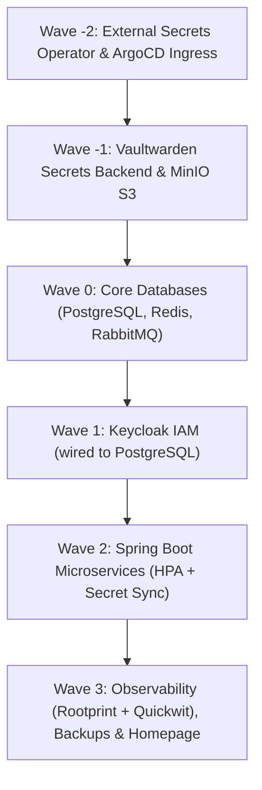

# K3s GitOps Cluster Setup

This repository contains the declarative GitOps manifests and bootstrap documentation for a single-node **K3s** Kubernetes cluster managed via **Argo CD**, featuring automated **Sync Waves**, **Vaultwarden + External Secrets Operator (ESO)** for secret injection, **Core Databases (PostgreSQL, Redis, RabbitMQ)**, **MinIO S3**, **Keycloak**, **Spring Boot microservices (with HPA)**, **Rootprint + Quickwit Observability**, and **Automated S3 Backups**.

---

## 🏗️ Architecture & Sync Waves Sequencing

Deployments are strictly sequenced using **Argo CD Sync Waves**. Argo CD will wait until each wave is **Healthy** before initiating the next wave:



| Wave | Application Manifest | Components Deployed | Description |
| :--- | :--- | :--- | :--- |
| **Wave -2** | `00-external-secrets.yaml`<br>`argocd.yaml` | External Secrets Operator (ESO), ArgoCD Ingress | Installs ESO CRDs and controller before any secret is required |
| **Wave -1** | `01-secrets-backend.yaml`<br>`02-minio.yaml` | Vaultwarden, ClusterSecretStore, MinIO S3 | Password management backend & local S3 object store |
| **Wave 0** | `03-databases.yaml` | PostgreSQL 16, Redis 7, RabbitMQ 3 | Core persistent data stores & message broker |
| **Wave 1** | `04-keycloak.yaml` | Keycloak 26 (PostgreSQL backend) | Centralized SSO and OIDC identity provider |
| **Wave 2** | `05-spring-apps.yaml` | Spring Boot apps (`app-core`), HPA, ExternalSecret | JVM container microservices auto-scaling on CPU load |
| **Wave 3** | `06-rootprint.yaml`<br>`07-backups.yaml`<br>`08-homepage.yaml` | Quickwit + Rootprint UI, Backup CronJob, Homepage | Searchable observability, automated daily S3 dumps & landing page |

---

## 🗺️ Domain Routing (`explorewithnk.com`)

All public HTTP/HTTPS traffic is handled by **NGINX Ingress Controller** with automatic TLS certificate provisioning via **cert-manager** (Let's Encrypt production):

| Application | Domain / URL | Namespace | Backend Service | Ingress Class | TLS Secret |
| :--- | :--- | :--- | :--- | :--- | :--- |
| **Homepage** | [`explorewithnk.com`](https://explorewithnk.com) | `default` | `homepage:80` | `nginx` | `explorewithnk-root-tls` |
| **Argo CD** | [`argocd.explorewithnk.com`](https://argocd.explorewithnk.com) | `argocd` | `argocd-server:80` | `nginx` | `explorewithnk-argocd-tls` |
| **Keycloak** | [`keycloak.explorewithnk.com`](https://keycloak.explorewithnk.com) | `keycloak` | `keycloak:80` | `nginx` | `explorewithnk-keycloak-tls` |
| **Vaultwarden** | [`vault.explorewithnk.com`](https://vault.explorewithnk.com) | `default` | `vaultwarden:80` | `nginx` | `vaultwarden-tls` |
| **MinIO Console**| [`minio.explorewithnk.com`](https://minio.explorewithnk.com) | `default` | `minio:9001` | `nginx` | `explorewithnk-minio-tls` |
| **Rootprint UI** | [`rootprint.explorewithnk.com`](https://rootprint.explorewithnk.com)| `default` | `rootprint-ui:80` | `nginx` | `explorewithnk-rootprint-tls` |

---

## 📁 Repository Directory Structure

```text
k3s-gitops/
├── argo/
│   ├── root-app.yaml                    # Master App-of-Apps pointing to argo/apps/
│   └── apps/
│       ├── 00-external-secrets.yaml     # Wave -2: ESO Operator
│       ├── 01-secrets-backend.yaml      # Wave -1: Vaultwarden & ClusterSecretStore
│       ├── 02-minio.yaml                # Wave -1: S3 Storage & Backups
│       ├── 03-databases.yaml            # Wave  0: PostgreSQL, Redis, RabbitMQ
│       ├── 04-keycloak.yaml             # Wave  1: Identity Provider
│       ├── 05-spring-apps.yaml          # Wave  2: Spring Boot Microservices + HPA
│       ├── 06-rootprint.yaml            # Wave  3: Rootprint + Quickwit Observability
│       ├── 07-backups.yaml              # Wave  3: Automated S3/MinIO Backup CronJobs
│       ├── 08-homepage.yaml             # Wave  3: Landing Page Application
│       └── argocd.yaml                  # Wave -2: Argo CD Ingress & TLS
├── bootstrap/
│   └── install/
│       └── k3s-install.sh              # Single-node VPS cluster bootstrap script
├── charts/                             # Helm values archives
│   ├── argocd/values.yaml              # Argo CD Helm values
│   └── keycloak/values.yaml            # Keycloak Helm values
└── manifests/
    ├── external-secrets/                # Helm values for ESO
    │   └── values.yaml
    ├── secrets-backend/                 # Vaultwarden deployment, PVC & ClusterSecretStore
    │   ├── vaultwarden.yaml
    │   ├── pvc.yaml
    │   └── cluster-secret-store.yaml
    ├── minio/                           # MinIO S3 deployment, service, PVC & TLS
    │   ├── minio.yaml
    │   └── minio-cert-manager.yaml
    ├── databases/                       # Core persistent data layer
    │   ├── postgresql.yaml              # PostgreSQL StatefulSet + Service
    │   ├── redis.yaml                   # Redis Deployment + Service + PVC
    │   └── rabbitmq.yaml                # RabbitMQ StatefulSet + Service
    ├── keycloak/                        # Keycloak deployment wired to PostgreSQL
    │   ├── keycloak.yaml
    │   └── keycloak-cert-manager.yaml
    ├── spring-apps/                     # Microservices with HPA and ExternalSecrets
    │   └── app-core.yaml
    ├── rootprint/                       # Quickwit log indexing + Rootprint UI
    │   ├── quickwit.yaml
    │   └── rootprint-ui.yaml
    ├── backups/                         # Automated CronJob pg_dumpall -> MinIO S3
    │   └── cronjob-postgres-backup.yaml
    ├── homepage/                        # Landing page manifests
    │   ├── deployment.yaml
    │   └── ingress.yaml
    ├── argocd/                          # Argo CD TLS certificates
    │   └── argocd-cert-manager.yaml
    └── cert-manager/                    # Let's Encrypt production ClusterIssuer
        └── my-cluster-issuer.yaml
```

---

## 🔐 Secrets Injection via Vaultwarden & ESO

1. **Vaultwarden Deployment**: Deployed in `default` namespace with a persistent volume (`5Gi`) mounted at `/data`.
2. **Master Account Setup**:
   - Access `https://vault.explorewithnk.com` to register your admin account.
   - Once registered, set `SIGNUPS_ALLOWED: "false"` in `manifests/secrets-backend/vaultwarden.yaml` to lock down signups.
3. **ClusterSecretStore**: Configured as `bitwarden-backend` to bridge ESO with your vault items.
4. **ExternalSecret Synchronization**:
   Apps define an `ExternalSecret` resource (e.g. `app-db-secret-sync`), which reads passwords dynamically and materializes a native Kubernetes Secret (`app-db-secrets`), used by container environment variables (`SPRING_DATASOURCE_PASSWORD`).

---

## 💾 Automated Database Backups (CronJob to MinIO S3)

The automated backup job (`manifests/backups/cronjob-postgres-backup.yaml`) runs every night at **02:00 AM UTC**:

1. Spins up an Amazon Linux / AWS CLI container.
2. Runs `pg_dumpall` against `postgresql.default.svc.cluster.local`.
3. Compresses the output with `gzip` (`pg_all_YYYYMMDD_HHMMSS.sql.gz`).
4. Uploads the compressed archive directly to the MinIO S3 bucket `homelab-backups`.

---

## 🚀 Execution & Git Push Steps

To deploy this setup to your cluster:

1. **Review and stage all changes:**
   ```bash
   git status
   git add argo/ manifests/ bootstrap/ README.md
   ```

2. **Commit the refactored architecture:**
   ```bash
   git commit -m "refactor: restructure for sequential ArgoCD waves, Vaultwarden/ESO secrets, and MinIO backups"
   ```

3. **Push to GitHub:**
   ```bash
   git push origin main
   ```

4. **Trigger Argo CD GitOps Sync:**
   From the Argo CD Web UI (`https://argocd.explorewithnk.com`):
   - Select the `root` application.
   - Click **Sync** (ensure **Prune** is checked).

   Or via CLI:
   ```bash
   argocd app sync root --prune
   ```

Argo CD will automatically orchestrate the rollout in sequence:
* **Wave -2** ➔ External Secrets Operator & Ingress
* **Wave -1** ➔ Vaultwarden & MinIO S3
* **Wave 0** ➔ PostgreSQL, Redis, RabbitMQ
* **Wave 1** ➔ Keycloak
* **Wave 2** ➔ Spring Boot Microservices (`app-core` + HPA)
* **Wave 3** ➔ Rootprint UI, Quickwit, Daily Backup CronJob & Homepage