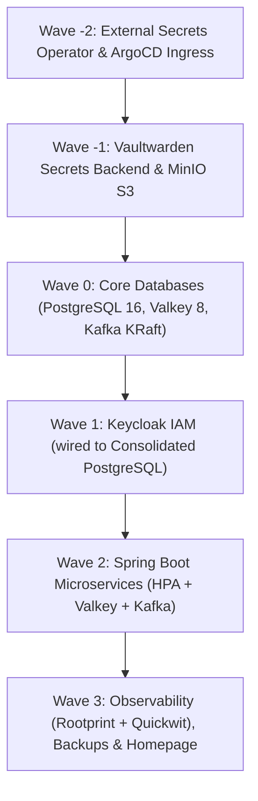

# K3s GitOps Cluster Setup

This repository contains the declarative GitOps manifests and bootstrap documentation for a single-node **K3s** Kubernetes cluster managed via **Argo CD**, featuring automated **Sync Waves**, **Vaultwarden + External Secrets Operator (ESO)** for secret injection, **Consolidated PostgreSQL 16**, **Valkey 8 (open-source Redis alternative)**, **Apache Kafka (KRaft mode, ZooKeeper-less)** + **Kafka UI**, **MinIO S3**, **Keycloak**, **Spring Boot microservices (with HPA)**, **Rootprint + Quickwit Observability**, and **Automated S3 Backups**.

---

## 🏗️ Architecture & Sync Waves Sequencing

Deployments are strictly sequenced using **Argo CD Sync Waves**. Argo CD will wait until each wave is **Healthy** before initiating the next wave:



| Wave | Application Manifest | Components Deployed | Description |
| :--- | :--- | :--- | :--- |
| **Wave -2** | `00-external-secrets.yaml`<br>`argocd.yaml` | External Secrets Operator (ESO), ArgoCD Ingress | Installs ESO CRDs and controller before any secret is required |
| **Wave -1** | `01-secrets-backend.yaml`<br>`02-minio.yaml` | Vaultwarden, ClusterSecretStore, MinIO S3 | Password management backend & local S3 object store |
| **Wave 0** | `03-databases.yaml` | PostgreSQL 16, Valkey 8, Apache Kafka (KRaft) + Kafka UI | Consolidated DB, in-memory cache/store, and distributed event log |
| **Wave 1** | `04-keycloak.yaml` | Keycloak 26 (wired to consolidated PostgreSQL) | Centralized SSO and OIDC identity provider |
| **Wave 2** | `05-spring-apps.yaml` | Spring Boot apps (`app-core`), HPA, ExternalSecret | JVM microservices with Valkey caching, Kafka streaming, and HPA |
| **Wave 3** | `06-rootprint.yaml`<br>`07-backups.yaml`<br>`08-homepage.yaml` | Quickwit + Rootprint UI, Backup CronJob, Homepage | Searchable observability, automated daily S3 dumps & landing page |

---

## ⚡ Valkey & Apache Kafka Architectural Decisions

### 1. Valkey (In Place of Redis)
* **Open-Source Freedom**: Fully open-source Linux Foundation project created following Redis's relicensing away from BSD.
* **100% Drop-in Compatibility**: Valkey supports the exact same Redis serialization protocol (RESP), port 6379, and commands. Spring Boot applications use `spring-data-redis` (Lettuce/Jedis) without any code modifications.
* **Compatibility Aliases**: Dual Kubernetes services (`valkey` and `redis`) are provisioned so any service querying either hostname works seamlessly.

### 2. Apache Kafka in KRaft Mode (In Place of RabbitMQ)
* **No ZooKeeper (KRaft Consensus)**: Built using Kafka 3.8 running Kafka Raft metadata mode (`process.roles=controller,broker`).
* **High Performance & Replayability**: Complete event log streaming platform enabling event sourcing, pub/sub, and audit trails.
* **Right-Sized for VPS**: Configured with `-Xms512M -Xmx1024M` JVM limits, leveraging the 32 GB RAM available on the node without memory bloat.
* **Kafka UI Included**: Deployed alongside Kafka with ingress at `https://kafka.explorewithnk.com` for topic and consumer group management.

---

## 🗺️ Domain Routing (`explorewithnk.com`)

All public HTTP/HTTPS traffic is handled by **NGINX Ingress Controller** with automatic TLS certificate provisioning via **cert-manager** (Let's Encrypt production):

| Application | Domain / URL | Namespace | Backend Service | Ingress Class | TLS Secret |
| :--- | :--- | :--- | :--- | :--- | :--- |
| **Homepage** | [`explorewithnk.com`](https://explorewithnk.com) | `default` | `homepage:80` | `nginx` | `explorewithnk-root-tls` |
| **Argo CD** | [`argocd.explorewithnk.com`](https://argocd.explorewithnk.com) | `argocd` | `argocd-server:80` | `nginx` | `explorewithnk-argocd-tls` |
| **Keycloak** | [`keycloak.explorewithnk.com`](https://keycloak.explorewithnk.com) | `keycloak` | `keycloak:80` | `nginx` | `explorewithnk-keycloak-tls` |
| **Vaultwarden** | [`vault.explorewithnk.com`](https://vault.explorewithnk.com) | `default` | `vaultwarden:80` | `nginx` | `vaultwarden-tls` |
| **MinIO Console**| [`minio.explorewithnk.com`](https://minio.explorewithnk.com) | `default` | `minio:9001` | `nginx` | `explorewithnk-minio-tls` |
| **Kafka UI** | [`kafka.explorewithnk.com`](https://kafka.explorewithnk.com) | `default` | `kafka-ui:80` | `nginx` | `explorewithnk-kafka-tls` |
| **Rootprint UI** | [`rootprint.explorewithnk.com`](https://rootprint.explorewithnk.com)| `default` | `rootprint-ui:80` | `nginx` | `explorewithnk-rootprint-tls` |

---

## 📁 Repository Directory Structure

```text
k3s-gitops/
├── argo/
│   ├── root-app.yaml                    # Master App-of-Apps pointing to argo/apps/
│   └── apps/
│       ├── 00-external-secrets.yaml     # Wave -2: ESO Operator
│       ├── 01-secrets-backend.yaml      # Wave -1: Vaultwarden & ClusterSecretStore
│       ├── 02-minio.yaml                # Wave -1: S3 Storage & Backups
│       ├── 03-databases.yaml            # Wave  0: PostgreSQL, Valkey, Kafka + Kafka UI
│       ├── 04-keycloak.yaml             # Wave  1: Identity Provider (Consolidated DB)
│       ├── 05-spring-apps.yaml          # Wave  2: Spring Boot Microservices + HPA
│       ├── 06-rootprint.yaml            # Wave  3: Rootprint + Quickwit Observability
│       ├── 07-backups.yaml              # Wave  3: Automated S3/MinIO Backup CronJobs
│       ├── 08-homepage.yaml             # Wave  3: Landing Page Application
│       └── argocd.yaml                  # Wave -2: Argo CD Ingress & TLS
├── bootstrap/
│   └── install/
│       └── k3s-install.sh              # Single-node VPS cluster bootstrap script
├── charts/                             # Helm values archives
│   ├── argocd/values.yaml              # Argo CD Helm values
│   └── keycloak/values.yaml            # Keycloak Helm values
└── manifests/
    ├── external-secrets/                # Helm values for ESO
    │   └── values.yaml
    ├── secrets-backend/                 # Vaultwarden deployment, PVC & ClusterSecretStore
    │   ├── vaultwarden.yaml
    │   ├── pvc.yaml
    │   └── cluster-secret-store.yaml
    ├── minio/                           # MinIO S3 deployment, service, PVC & TLS
    │   ├── minio.yaml
    │   └── minio-cert-manager.yaml
    ├── databases/                       # Core persistent data layer
    │   ├── postgresql.yaml              # PostgreSQL 16 StatefulSet + Multi-DB Init
    │   ├── valkey.yaml                  # Valkey 8 Deployment + Service + PVC
    │   └── kafka.yaml                   # Apache Kafka KRaft StatefulSet + Kafka UI
    ├── keycloak/                        # Keycloak deployment wired to PostgreSQL
    │   ├── keycloak.yaml
    │   └── keycloak-cert-manager.yaml
    ├── spring-apps/                     # Microservices with HPA, Valkey & Kafka
    │   └── app-core.yaml
    ├── rootprint/                       # Quickwit log indexing + Rootprint UI
    │   ├── quickwit.yaml
    │   └── rootprint-ui.yaml
    ├── backups/                         # Automated CronJob pg_dumpall -> MinIO S3
    │   └── cronjob-postgres-backup.yaml
    ├── homepage/                        # Landing page manifests
    │   ├── deployment.yaml
    │   └── ingress.yaml
    ├── argocd/                          # Argo CD TLS certificates
    │   └── argocd-cert-manager.yaml
    └── cert-manager/                    # Let's Encrypt production ClusterIssuer
        └── my-cluster-issuer.yaml
```

---

## 🗄️ PostgreSQL Consolidation & Data Migration (Option B)

1. **Multi-Database Setup**:
   The consolidated PostgreSQL instance (`manifests/databases/postgresql.yaml`) initializes:
   * `app_db`: Primary database for Spring Boot microservices.
   * `bitnami_keycloak`: Dedicated database for Keycloak IAM with user `bn_keycloak1`.
2. **Restoring Live Keycloak Data**:
   A verified backup of your live Keycloak database has been extracted. Once the new PostgreSQL is running in `default`:
   ```bash
   kubectl cp /path/to/keycloak_backup.sql default/postgresql-0:/tmp/keycloak_backup.sql
   kubectl exec -n default postgresql-0 -- psql -U postgres -d bitnami_keycloak -f /tmp/keycloak_backup.sql
   ```
3. **Decommissioning Old PostgreSQL**:
   After verifying Keycloak operates normally against the consolidated PostgreSQL, delete the old statefulset in `keycloak`:
   ```bash
   kubectl delete statefulset keycloak-app-postgresql -n keycloak
   kubectl delete pvc data-keycloak-app-postgresql-0 -n keycloak
   ```

---

## 🚀 Execution & Git Push Steps

1. **Review and stage all changes:**
   ```bash
   git status
   git add argo/ manifests/ README.md
   ```

2. **Commit the refactored architecture:**
   ```bash
   git commit -m "feat: adopt Valkey and Kafka KRaft with consolidated PostgreSQL"
   ```

3. **Push to GitHub:**
   ```bash
   git push origin whole-infra
   ```

4. **Trigger Argo CD GitOps Sync:**
   From the Argo CD Web UI (`https://argocd.explorewithnk.com`):
   - Select the `root` application.
   - Click **Sync** (with **Prune** enabled).