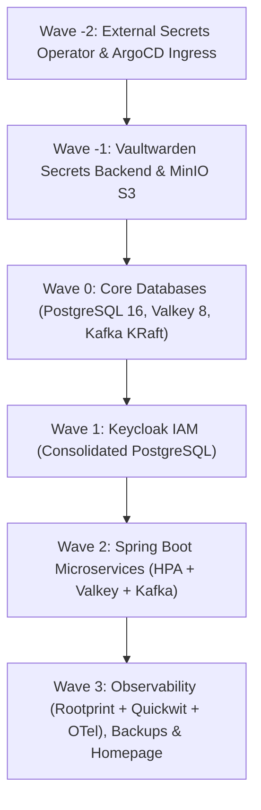
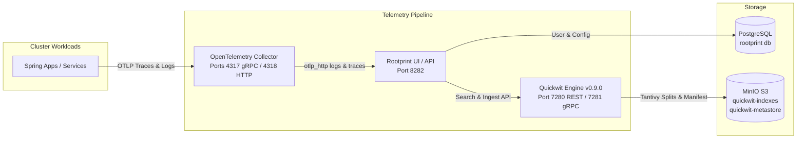

# K3s GitOps Cluster Setup

This repository contains declarative GitOps manifests and operational documentation for a single-node **K3s** Kubernetes cluster managed via **Argo CD**, featuring automated **Sync Waves**, **Vaultwarden + External Secrets Operator (ESO)** for secret management, **Consolidated PostgreSQL 16**, **Valkey 8 (open-source Redis alternative)**, **Apache Kafka (KRaft mode, ZooKeeper-less)** + **Kafka UI**, **MinIO S3**, **Keycloak IAM**, **Spring Boot microservices (with HPA)**, **Rootprint + Quickwit + OpenTelemetry Observability (backed by MinIO S3)**, and **Automated S3 Backups**.

---

## 🏗️ Architecture & Sync Waves Sequencing

Deployments are strictly sequenced using **Argo CD Sync Waves**. Argo CD ensures each wave is **Healthy** before proceeding to dependent workloads:



| Wave | Application Manifest | Components Deployed | Description |
| :--- | :--- | :--- | :--- |
| **Wave -2** | `00-external-secrets.yaml`<br>`argocd.yaml` | External Secrets Operator (ESO), ArgoCD Ingress | Installs ESO CRDs and controller before secret consumer workloads |
| **Wave -1** | `01-secrets-backend.yaml`<br>`02-minio.yaml` | Vaultwarden, ClusterSecretStore, MinIO S3 | Password management backend & local S3 object storage |
| **Wave 0** | `03-databases.yaml` | PostgreSQL 16, Valkey 8, Apache Kafka (KRaft) + Kafka UI | Consolidated DB, in-memory cache/store, and distributed event log |
| **Wave 1** | `04-keycloak.yaml` | Keycloak 26 (wired to consolidated PostgreSQL) | Centralized SSO and OIDC identity provider |
| **Wave 2** | `05-spring-apps.yaml`<br>`10-otel-operator.yaml` | Spring Boot apps (`app-core`), HPA, OpenTelemetry Operator | JVM microservices with Valkey caching, Kafka streaming, and OTel auto-instrumentation |
| **Wave 3** | `06-rootprint.yaml`<br>`07-backups.yaml`<br>`08-homepage.yaml`<br>`09-monitoring.yaml` | Rootprint UI, Quickwit, OTel Collector, Backup CronJob, Homepage, Prometheus & Grafana | Distributed logging & tracing, automated daily S3 dumps, landing page, cluster metrics & Grafana |

---

## 🔭 Observability Architecture (Rootprint + Quickwit + OpenTelemetry)

The cluster uses **Rootprint** with **Quickwit v0.9.0** and **OpenTelemetry Collector Contrib** for lightweight, sub-second log and distributed trace querying backed entirely by **MinIO S3**:



### Key Configurations:
* **Rootprint Core (`ghcr.io/rootprint/rootprint:latest`)**: Listens on port `8282`, connects to consolidated PostgreSQL (`rootprint` database), routes queries to Quickwit, and exposes the web UI at `https://rootprint.explorewithnk.com`.
* **Quickwit v0.9.0 (`quickwit/quickwit:v0.9.0`)**: Runs with `QW_S3_FLAVOR: minio`, `QW_S3_ENDPOINT: http://minio.default.svc.cluster.local:9000`, and `QW_S3_FORCE_PATH_STYLE_ACCESS: "true"`. Indices are stored in `s3://quickwit-indexes` and cluster metadata in `s3://quickwit-metastore`.
* **OpenTelemetry Collector (`otel/opentelemetry-collector-contrib:latest`)**:
  * Receivers: OTLP gRPC (`4317`), OTLP HTTP (`4318`).
  * Processors: Transform processor with regex parsing for HTTP request status codes and methods.
  * Exporters: OTLP HTTP exporter forwarding telemetry directly to `http://rootprint-ui.default.svc.cluster.local:8282/v1/logs` and `/v1/traces`.

---

## ⚡ Valkey & Apache Kafka Architectural Decisions

### 1. Valkey 8 (In Place of Redis)
* **Open-Source Freedom**: Fully open-source Linux Foundation project created following Redis's relicensing away from BSD.
* **100% Drop-in Compatibility**: Valkey supports the exact same Redis serialization protocol (RESP), port 6379, and commands. Spring Boot applications use `spring-data-redis` (Lettuce/Jedis) without any code modifications.
* **Compatibility Aliases**: Dual Kubernetes services (`valkey` and `redis`) are provisioned so any service querying either hostname works seamlessly.

### 2. Apache Kafka in KRaft Mode (In Place of RabbitMQ)
* **No ZooKeeper (KRaft Consensus)**: Built using Kafka 3.8 running Kafka Raft metadata mode (`process.roles=controller,broker`, `CLUSTER_ID=MkU3OEVBNTcwNTJENDM2Qk`).
* **High Performance & Replayability**: Complete event log streaming platform enabling event sourcing, pub/sub, and audit trails.
* **Right-Sized for VPS**: Configured with `-Xms512M -Xmx1024M` JVM limits, leveraging the 32 GB RAM available on the node without memory bloat.
* **Kafka UI Included**: Deployed alongside Kafka with ingress at `https://kafka.explorewithnk.com` for topic and consumer group management.

---

## 🗄️ Consolidated PostgreSQL Architecture

A single, high-performance PostgreSQL 16 instance (`manifests/databases/postgresql.yaml`) hosts the following isolated databases:

| Database | Owner Role | Purpose | Credentials Secret |
| :--- | :--- | :--- | :--- |
| `app_db` | `postgres` | Spring Boot microservices & application tables | `app-db-secrets` (`POSTGRES_PASSWORD`) |
| `bitnami_keycloak` | `bn_keycloak1` | Keycloak IAM realms (`master`, `auth-bff`, `temporal`) | `app-db-secrets` (`KEYCLOAK_DB_PASSWORD`) |
| `rootprint` | `rootprint` | Rootprint authentication, users, views & incident metadata | Dedicated role `rootprint:rootprint` |

### S3 Automated Backups:
* A daily Kubernetes CronJob runs at 02:00 UTC, executing `pg_dumpall`, compressing the dump with gzip, and streaming it directly to the MinIO `k3s-backups` S3 bucket.

---

## 🗺️ Domain Routing (`explorewithnk.com`)

All public HTTP/HTTPS traffic is handled by **NGINX Ingress Controller** with automatic TLS certificate provisioning via **cert-manager** (Let's Encrypt production):

| Application | Domain / URL | Namespace | Backend Service | Ingress Class | TLS Secret |
| :--- | :--- | :--- | :--- | :--- | :--- |
| **Homepage** | [`explorewithnk.com`](https://explorewithnk.com) | `default` | `homepage:80` | `nginx` | `explorewithnk-root-tls` |
| **Argo CD** | [`argocd.explorewithnk.com`](https://argocd.explorewithnk.com) | `argocd` | `argocd-server:80` | `nginx` | `explorewithnk-argocd-tls` |
| **Keycloak** | [`keycloak.explorewithnk.com`](https://keycloak.explorewithnk.com) | `keycloak` | `keycloak:80` | `nginx` | `explorewithnk-keycloak-tls` |
| **Vaultwarden** | [`vault.explorewithnk.com`](https://vault.explorewithnk.com) | `default` | `vaultwarden:80` | `nginx` | `vaultwarden-tls` |
| **MinIO Console**| [`minio.explorewithnk.com`](https://minio.explorewithnk.com) | `default` | `minio:9001` | `nginx` | `explorewithnk-minio-tls` |
| **Kafka UI** | [`kafka.explorewithnk.com`](https://kafka.explorewithnk.com) | `default` | `kafka-ui:80` | `nginx` | `explorewithnk-kafka-tls` |
| **Rootprint UI** | [`rootprint.explorewithnk.com`](https://rootprint.explorewithnk.com)| `default` | `rootprint-ui:80` | `nginx` | `explorewithnk-rootprint-tls` |
| **Grafana** | [`grafana.explorewithnk.com`](https://grafana.explorewithnk.com)| `monitoring` | `cluster-monitoring-grafana:80` | `nginx` | `explorewithnk-grafana-tls` |

---

## 📁 Repository Directory Structure

```text
k3s-gitops/
├── argo/
│   ├── root-app.yaml                    # Master App-of-Apps pointing to argo/apps/
│   └── apps/
│       ├── 00-external-secrets.yaml     # Wave -2: ESO Operator
│       ├── 01-secrets-backend.yaml      # Wave -1: Vaultwarden & ClusterSecretStore
│       ├── 02-minio.yaml                # Wave -1: S3 Storage & Backups
│       ├── 03-databases.yaml            # Wave  0: PostgreSQL, Valkey, Kafka + Kafka UI
│       ├── 04-keycloak.yaml             # Wave  1: Identity Provider (Consolidated DB)
│       ├── 05-spring-apps.yaml          # Wave  2: Spring Boot Microservices + HPA
│       ├── 06-rootprint.yaml            # Wave  3: Rootprint + Quickwit + OTel Observability
│       ├── 07-backups.yaml              # Wave  3: Automated S3/MinIO Backup CronJobs
│       ├── 08-homepage.yaml             # Wave  3: Landing Page Application
│       ├── 09-monitoring.yaml           # Wave  3: Prometheus + Grafana Observability
│       ├── 10-otel-operator.yaml        # Wave  2: OpenTelemetry Operator & Auto-Instrumentation
│       └── argocd.yaml                  # Wave -2: Argo CD Ingress & TLS
├── bootstrap/
│   └── install/
│       └── k3s-install.sh              # Single-node VPS cluster bootstrap script
├── charts/                             # Helm values archives
│   ├── argocd/values.yaml              # Argo CD Helm values
│   └── keycloak/values.yaml            # Keycloak Helm values
└── manifests/
    ├── external-secrets/                # Helm values for ESO
    │   └── values.yaml
    ├── secrets-backend/                 # Vaultwarden deployment, PVC & ClusterSecretStore
    │   ├── vaultwarden.yaml
    │   ├── pvc.yaml
    │   └── cluster-secret-store.yaml
    ├── minio/                           # MinIO S3 deployment, service, PVC & TLS
    │   ├── minio.yaml
    │   └── minio-cert-manager.yaml
    ├── databases/                       # Core persistent data layer
    │   ├── postgresql.yaml              # PostgreSQL 16 StatefulSet + Multi-DB Init
    │   ├── valkey.yaml                  # Valkey 8 Deployment + Service + PVC
    │   └── kafka.yaml                   # Apache Kafka KRaft StatefulSet + Kafka UI
    ├── keycloak/                        # Keycloak IAM Declarative Manifests
    │   ├── keycloak.yaml
    │   ├── servicemonitor.yaml
    │   └── keycloak-cert-manager.yaml
    ├── spring-apps/                     # Microservices with HPA, Valkey & Kafka
    │   └── app-core.yaml
    ├── rootprint/                       # Observability stack
    │   ├── quickwit.yaml                # Quickwit v0.9.0 with MinIO S3 backend
    │   ├── rootprint-ui.yaml            # Rootprint Core & UI
    │   ├── otel-collector.yaml          # OpenTelemetry Collector Contrib
    │   └── instrumentation.yaml         # OpenTelemetry Auto-Instrumentation CR
    ├── backups/                         # Automated CronJob pg_dumpall -> MinIO S3
    │   └── cronjob-postgres-backup.yaml
    ├── homepage/                        # Landing page manifests
    │   ├── deployment.yaml
    │   └── ingress.yaml
    ├── argocd/                          # Argo CD TLS certificates
    │   └── argocd-cert-manager.yaml
    └── cert-manager/                    # Let's Encrypt production ClusterIssuer
        └── my-cluster-issuer.yaml
```

---

## 🛠️ Operations & Useful Commands

### 1. Ingesting Telemetry via OpenTelemetry
Services inside the cluster can export traces and logs to the collector using standard OTLP endpoints:
* **gRPC**: `otel-collector.default.svc.cluster.local:4317`
* **HTTP**: `http://otel-collector.default.svc.cluster.local:4318`

### 2. Inspecting MinIO S3 Buckets
To verify the S3 buckets utilized by Quickwit and backups directly on the storage PVC:
```bash
kubectl exec -n default deployment/minio -- /bin/sh -c "ls -la /data/quickwit-metastore /data/quickwit-indexes /data/k3s-backups"
```

### 3. Decommissioning Old Keycloak PostgreSQL
Once Keycloak has been verified working against the consolidated PostgreSQL in the `default` namespace, reclaim old storage:
```bash
kubectl delete statefulset keycloak-app-postgresql -n keycloak
kubectl delete pvc data-keycloak-app-postgresql-0 -n keycloak
```

### 4. GitOps Synchronization
Sync status is managed declaratively on branch `main`. To manually trigger an immediate sync of the entire cluster:
```bash
kubectl -n argocd patch application root --type merge -p '{"operation":{"sync":{"prune":true}}}'
```